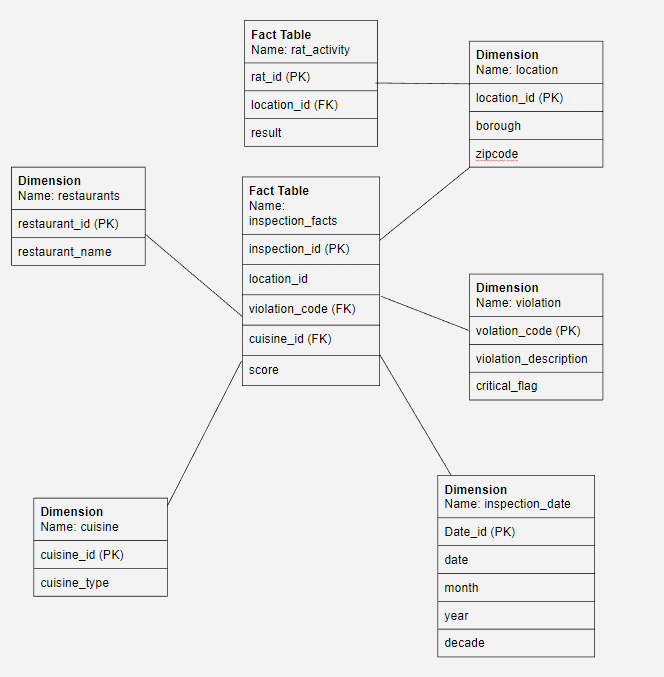
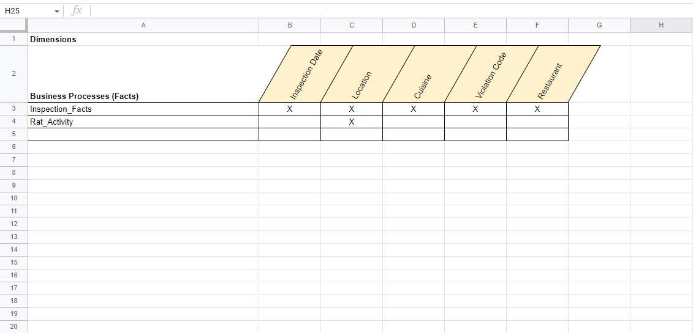
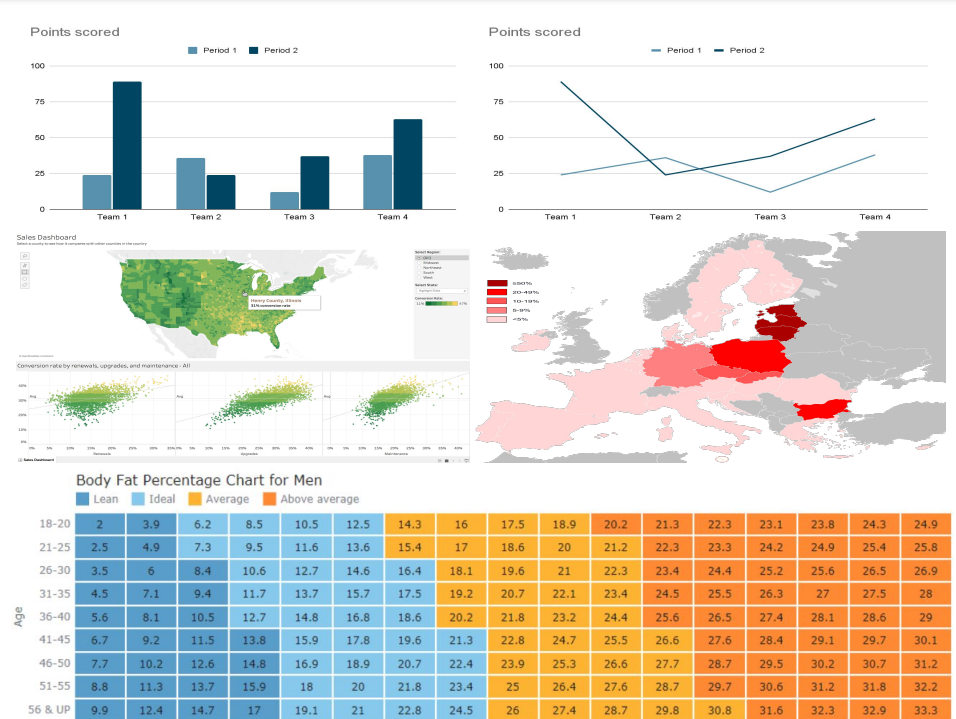
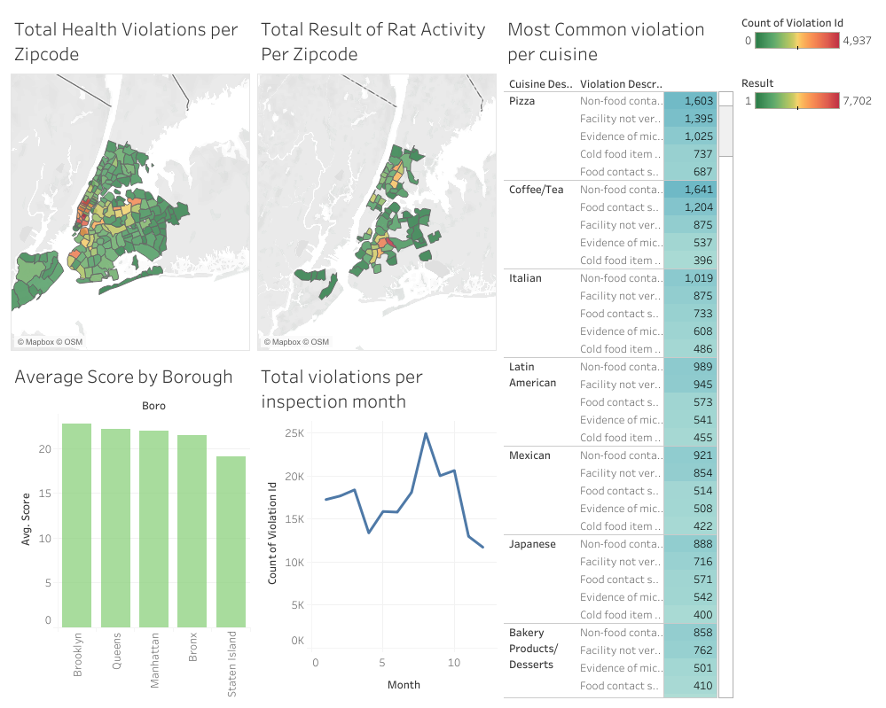

# Rats and Restaurants Violation in NYC
- Author(s): Fatimah Nauman, James Mancuso, Jeison Montoya, Jerry Pesantes, Tenzin Norsang
- Date Created: 
  - DOHMH New York City Restaurant Inspection Results - August 2014
  - Rodent Inspection - November 2015 
- Class: CIS 9440

Project Objective: Follow the Kimball Lifecycle to design and develop a public, cloud-based Data Warehouse with a functioning BI Applications

Project Tools:
The tools used to build this Data Warehouse were: (change this to make applicable to your project)
1. For data integration - python
2. For data warehousing - Google BigQuery
3. For Business Intelligence - Tableau

## Kimball Lifecycle Project Stages

### Project Planning

#

Motivation for project: 
 - We hope to gain an understanding regarding the violations of restaurants in NYC. Depending on the cuisine, location, and violation types, we are interested in knowing if there are any correlations between locations (borough), rat populations, cuisines, etc.

Description of the issues or opportunities the project will address: 
 - Our goal of this project is to have an understanding of the areas that are most likely to receive restaurant health violations in hopes of improving sanitation conditions and a decrease in food related illnesses. 

Project Business or Organization Value:
- If restaurants are more aware of the location of violation hotspots they might want to avoid or will know that they will have to face extra costs to deal with these violations. 

Data Sources:
1. [Restaurant Data](https://data.cityofnewyork.us/Health/DOHMH-New-York-City-Restaurant-Inspection-Results/43nn-pn8j)
2. [Rodent Data](https://data.cityofnewyork.us/Health/Rodent-Inspection/p937-wjvj)

### Business Requirements Definition

List of Data Warehouse KPI's:
1. Average score by borough
2. Total health violations per zip code
3. Total result of rat activity per zip code 
4. Most common violation per cuisine 
5. Total violations per inspection month 

### Dimensional Model

This project's Dimensional Model consists of (x) Facts and (y) Dimensions

Use correct file path here to show picture of dimensional model...

This project's Kimball Bus Matrix:

Use correct file path here to show picture of dimensional model...

### Business Intelligence Design and Development

List of Visualizations for each KPI:
1. We used a bar chart because we want to see the cumulative average for each of the five boroughs. Since there are only 5 boroughs this bar chart shows that information easily and we can quickly see which borough has the highest score. We chose a bar chart because it was a comparative analysis.
2. We used a map to show the violation count by zipcode with a heat index to show that certain parts of the city have higher violations than other parts of the city. This map provides us with an easy way to understand the geographic area the data is covering and also which areas. The map allowed us to do a geographic analysis.
3. We chose a map to show the rat activity per zip code throughout the city. This one differs from the one above in that we are only focusing on the rat activity. The first thing we notice when we look at this visualization is that there are parts of the city that are not colored in, to our surprise there was no data gathered between Midtown and Lower Manhattan. We also used a map for this as well to compare geographic analysis with #2. 
4. We used highlight tables to show the most common violations per cuisine because it allowed us to contribution analysis. In this graph we can see that the most common violations for most cuisines are non-food contact surface improperly constructed, food contact surface not properly washed and sanitized, facility not vermin(rodents, insect, etc) proof, evidence of mice, and cold food item held above 41°F. This clearly shows that there is a connection between our datasets of rats and cuisines. Most of the cuisines have evidence of mice which affects the grade review for the cuisines.
5. We used a continuous line graph to show the total violations per inspection month which allowed us to do a Time-Series Analysis. If we analyze this graph, we can see that from June to August the number of violations increases. This can happen because of many reasons. During summer, more people tend to go out to enjoy a meal at restaurants which means more food activity in the restaurant which is perfect for rats and insects to invade the place. Also, the weather conditions are so hot and cold food items are not preserved in good conditions based on our #4 KPI. 

BI Application Wireframe design:

Use correct file path here to show picture of Wireframe design...

Use correct file path here to show picture of Dashboard...

### Deployment

The project was deployed on Tableau Public: [Dashboard](https://public.tableau.com/app/profile/tenzin.norsang/viz/RestaurantsandViolationsinNYCDashboard/RestaurantsandViolationsinNYCDashboard?publish=yes)
